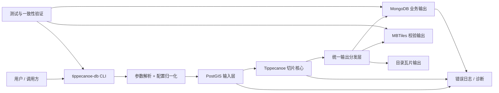
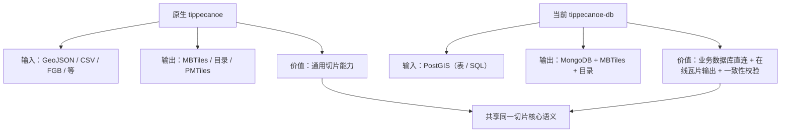
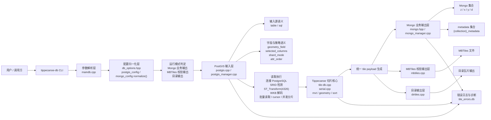
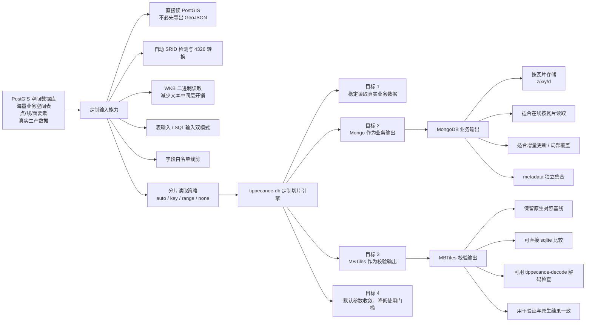
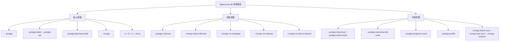
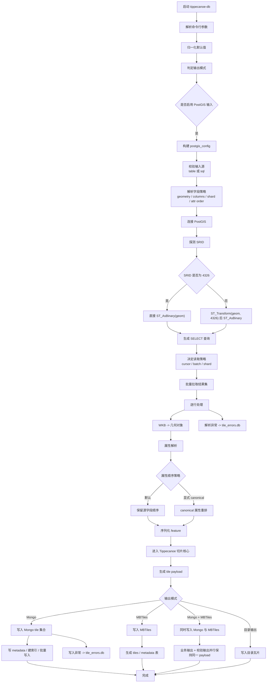
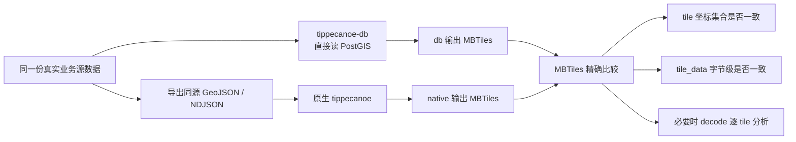
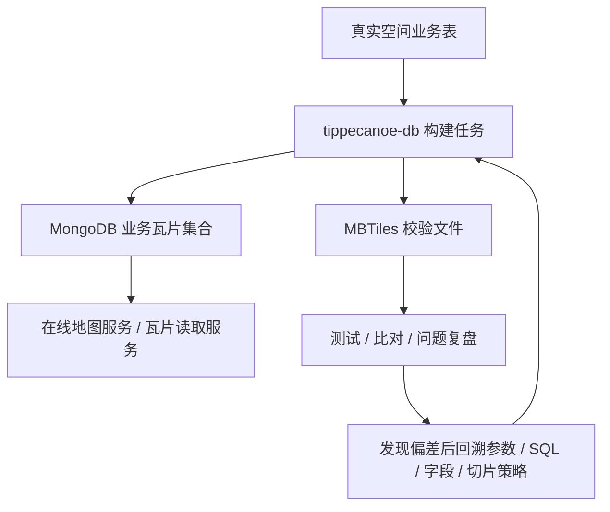

# tippecanoe-db 项目逻辑设计与定制化功能说明

> 更新时间：2026-04-26  
> 适用范围：当前 `tippecanoe-db` 定制版本  
> 目的：完整说明当前项目的整体结构、核心逻辑、定制化能力、处理流程与一致性验证路径

---

## 1. 文档目标

这份文档不是历史记录，也不是测试过程笔记，而是面向“当前项目现状”的结构化说明，重点回答下面几个问题：

- 这个项目整体是怎么组织的
- 原生 `tippecanoe` 与当前 `tippecanoe-db` 的关系是什么
- `PostGIS` 输入、`MongoDB` 输出到底新增了什么能力
- 为什么要保留 `MBTiles`
- 参数、模块、流程、验证之间如何互相配合
- 当前设计是否合理，边界在哪里

---

## 2. 项目定位

当前项目的核心不是重新发明一个切片器，而是在原生 `tippecanoe` 切片主链路之上，增加一条更贴近真实业务系统的数据库输入 / 业务输出通道。

一句话概括：

> `tippecanoe-db` = 用 `PostGIS` 直接读取真实空间数据，用 `MongoDB` 承担业务瓦片输出，用 `MBTiles` 保留原生结果校验基线的定制化切片版本。

因此它的目标不是替代原生 `tippecanoe` 的所有场景，而是解决下面这类业务问题：

- 数据源本来就在空间数据库里，不希望先导出大规模 GeoJSON
- 输出最终是在线服务消费的瓦片数据，希望直接落到数据库
- 仍然需要一个可以和原生结果做精确比对的校验载体
- 普通用户不希望面对过多内部调优参数

---

## 3. 项目全景图

### 3.1 全景说明

- `CLI` 层负责接住用户命令，但尽量不承担过多业务推断
- `配置归一化` 层负责把默认值与兼容逻辑集中起来
- `PostGIS 输入层` 负责稳定、可控地把数据库结果送进切片主链路
- `Tippecanoe 切片核心` 仍然是统一的切片真相来源
- `输出分发层` 负责把同一份 tile payload 分别写入不同目标
- `MongoDB` 与 `MBTiles` 不是两套切片逻辑，而是同一切片结果的不同落地形式

---

## 4. 原生与定制版关系图

### 4.1 关系说明

- 当前定制版不是完全独立的另一个项目
- 它复用了原生切片主链路的关键能力
- 真正新增的是：
  - `PostGIS` 直读输入层
  - `MongoDB` 业务输出层
  - 参数分层与默认值收口
  - 与原生结果的一致性验证路径

---

## 5. 总体架构图

### 5.1 分层职责

#### 参数解析层

- 负责识别用户输入
- 负责兼容旧参数与短连接串
- 不再承担过多分散的默认值推断

#### 配置归一化层

- 负责统一默认值
- 负责把“兼容参数”转换成当前运行配置
- 负责决定哪些行为属于默认路径，哪些属于高级覆盖

#### PostGIS 输入层

- 负责输入源识别：表输入或 SQL 输入
- 负责几何字段、属性字段、分片策略、读取策略
- 负责 SRID 检测与必要的 4326 转换
- 负责从 PostgreSQL 结果集读取 WKB，并转成内部几何对象

#### Tippecanoe 切片核心

- 负责 feature 序列化
- 负责几何排序、分桶、压缩、tile payload 生成
- 这里仍然是整个系统的切片真相来源

#### 输出层

- `MongoDB`：承担业务输出
- `MBTiles`：承担校验输出
- `目录输出`：保留本地瓦片目录模式

---

## 6. 模块职责图

```mermaid
flowchart TD
    A["maindb.cpp"] --> A1["命令行入口"]
    A --> A2["参数解析"]
    A --> A3["运行模式摘要"]

    B["db_options.hpp"] --> B1["核心帮助参数定义"]
    B --> B2["高级帮助参数定义"]
    B --> B3["默认值与输出模式归一化"]

    C["postgis.hpp / postgis.cpp"] --> C1["PostGIS 配置语义"]
    C --> C2["SRID / SQL / 表查询构建"]
    C --> C3["WKB 读取与属性处理"]

    D["postgis_manager.cpp"] --> D1["并发读取管理"]
    D --> D2["线程与分片策略摘要"]

    E["tile-db.cpp"] --> E1["切片主流程"]
    E --> E2["统一输出分发"]

    F["mongo.hpp / mongo_manager.cpp"] --> F1["Mongo 连接与批量写入"]
    F --> F2["metadata / 索引 / 统计"]

    G["mbtiles.cpp"] --> G1["MBTiles 文件写入"]
    H["unit.cpp"] --> H1["参数 / 帮助 / 语义测试"]
```

### 6.1 模块设计判断

当前模块分工已经比早期更清楚，但仍然保持了“在原工程里渐进收口”的特点：

- 优点：风险可控，不会一次性推翻原有主链路
- 缺点：仍然带有演进式改造的痕迹，不是从零设计的天然独立架构

---

## 7. 定制化能力图

### 7.1 定制化能力说明

#### 为什么使用 PostGIS 输入

- 数据本来就在空间数据库里
- 避免大规模中间导出
- 可以利用数据库层做字段筛选、空间筛选、业务筛选
- 可以直接以 SQL 表达真实业务口径

#### 为什么使用 Mongo 输出

- 业务读取通常按瓦片粒度进行
- 便于在线服务按 `(z, x, y)` 查询
- 便于增量更新和局部覆盖

#### 为什么必须保留 MBTiles

- 它不是业务主输出，而是统一校验基线
- 它能让当前定制链路持续接受原生结果约束
- 没有 `MBTiles`，就很难长期证明“定制化没有悄悄偏离原生切片结果”

---

## 8. 参数分层图

### 8.1 参数设计说明

这套分层的目标不是“把参数藏起来”，而是：

- 让普通用户优先看到真正必要的参数
- 把高级能力留给确实需要的人
- 把调优/排障旋钮从主帮助路径里移出去

当前版本一个关键点是：

- 默认属性顺序已经调整为“保留源字段顺序”
- 这样普通用户只用核心参数时，也更容易和原生 `tippecanoe` 对齐

---

## 9. 详细执行流程图

### 9.1 处理流程说明

这一流程里最关键的设计点有四个：

1. 输入首先被收口到统一配置对象  
不是边解析边执行，而是先形成清晰的运行配置。

2. PostGIS 读取层只负责“稳定读取”  
它不应该悄悄改变主链路语义，只负责把数据库数据正确喂给切片核心。

3. 切片核心仍然保持统一真相来源  
Mongo 与 MBTiles 的结果应来自同一 tile payload，而不是两套逻辑。

4. 默认属性顺序现在已经与业务目标一致  
默认保留源字段顺序，使得默认路径更容易与原生结果对齐。

---

## 10. 一致性验证闭环图

### 10.1 验证闭环说明

这个验证闭环是当前项目非常重要的一部分，因为它回答的是：

> 定制化之后，结果到底有没有偏离原生主链路？

当前已完成的关键事实：

- 5000 条真实样本：字节级一致
- 20000 条真实样本：字节级一致

这说明当前版本至少在真实样本范围内，已经满足：

- 逻辑正确
- 输出稳定
- 定制化没有破坏原生结果语义

---

## 11. 业务运行闭环图

### 11.1 业务闭环说明

当前版本真正合理的地方，不只是“能跑”，而是形成了一个业务闭环：

- 构建任务从真实数据库读取数据
- 业务输出直接进入 Mongo
- 校验输出进入 MBTiles
- 线上问题或比对偏差可以回到校验链路定位

这比“只有业务输出，没有可验证基线”的系统稳得多。

---

## 12. 当前设计是否合理

### 12.1 合理的地方

- 参数已经开始分层，普通用户不必面对所有内部旋钮
- 默认值已经收口，行为比之前更可追踪
- `PostGIS` 输入层、切片核心、输出层的职责边界更清楚
- `Mongo` 与 `MBTiles` 的角色已经清晰分离
- 已经完成真实数据一致性验证，不再只是“理论上应该没问题”

### 12.2 仍需长期注意的地方

- 这是演进式改造，不是从零组件化设计，局部仍然保留历史痕迹
- 历史文档较多，必须明确当前真相来源
- 超大规模全量数据在低 zoom 下仍可能触发原生切片上限，这属于数据分布与切片策略问题，不是 Mongo / PostGIS 定制功能本身的问题

### 12.3 专家视角判断

如果把当前项目放在工程视角下评价，它已经达到了一个比较健康的状态：

- 架构上：分层基本成立
- 逻辑上：主链路清楚
- 业务上：Mongo 与 MBTiles 语义明确
- 验证上：有闭环
- 易用性上：默认参数比之前更合理

它最重要的价值不是“功能更多”，而是：

- 更贴近真实数据链路
- 更容易进入在线业务系统
- 同时还能持续受到原生结果一致性的约束

---

## 13. 最终总结

当前 `tippecanoe-db` 可以这样理解：

> 它不是一条脱离原生 `tippecanoe` 的新路线，而是一条围绕真实业务数据库输入、在线瓦片输出和结果一致性验证收口过的定制化主链路。

其中最关键的三个定制化判断是：

1. `PostGIS` 负责真实业务空间数据输入  
2. `MongoDB` 负责业务瓦片输出  
3. `MBTiles` 负责与原生结果保持一致性的校验基线

这三个角色分清楚之后，项目的架构、参数、流程和验证路径才真正稳定下来。
